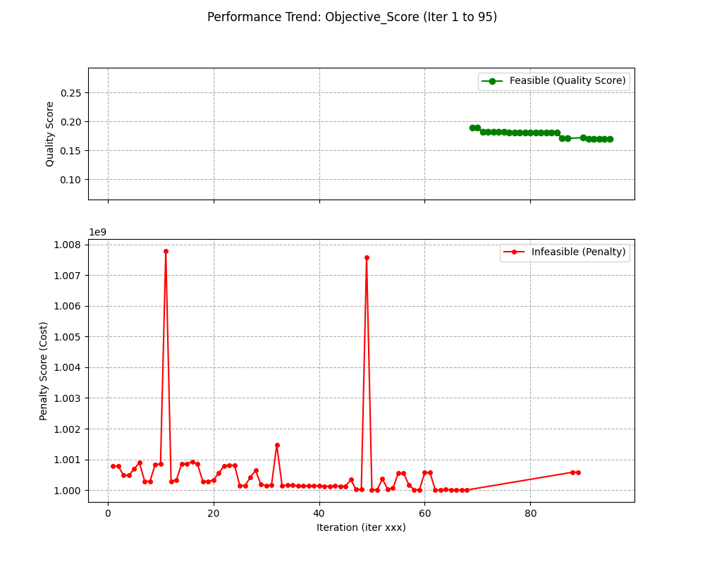

# 模拟电路自动化设计 (Automated Analog Circuit Design)

## 1. 项目简介

本项目旨在为复杂的模拟电路（以运算放大器OPA为例）提供一个自动化的参数优化解决方案。传统的模拟电路设计高度依赖工程师的经验，参数调优过程耗时且繁琐。本平台通过将电路设计问题抽象为数学优化问题，利用先进的算法智能地探索巨大的参数空间，以期在满足多重性能约束（如功耗、增益、稳定性等）的前提下，找到最优的器件尺寸。

该平台基于 `pyAether` EDA环境，实现了从电路图的自动解析、拓扑结构分析，到参数化仿真和智能迭代优化的完整闭环流程。

## 2. 优化方法：带阈值的层级化机会主义梯度下降 (V4)

经过多轮迭代与验证，我们摒弃了传统的全局优化算法（如遗传算法、贝叶斯优化），最终独创并实现了一种更符合模拟电路设计直觉的、高效的**“带阈值的两阶段层级优化算法”**。

该算法的核心思想是将一个复杂的高维混合空间优化问题，分解为两个更简单、更聚焦的子问题，模拟了资深工程师“先粗调，后精调”的设计流程。

### 2.1 阶段一：整数空间探索 (粗调 - 定骨架)

在这一阶段，我们专注于优化决定电路核心工作点和功耗量级的**整数参数 `m` (multiplier)**，同时将所有连续参数 (`fw`, `l`) 固定。

- **目标**: 快速找到一个功耗合理、驱动能力合适的“电路骨架”。
- **策略**: 采用**机会主义爬山法**。对每个`m`参数进行`+/- 1`的微扰。一旦发现任何一个微扰能带来超过预设阈值 (`alpha`) 的显著性能提升，算法会**立即采纳**这个更优解作为新起点，并重新开始扫描，极大地加速了收敛。

### 2.2 阶段二：连续空间微调 (精调 - 调AC)

在找到最优的“骨架”后，我们锁定所有`m`参数，转而优化决定电路交流特性的**连续参数 `fw` (finger width) 和 `l` (length)**。

- **目标**: 在已确定的优良工作区内，精细打磨电路的增益（Gain）、带宽（UGB）和相位裕度（Phase Margin）。
- **策略**: 同样采用机会主义爬山法，但微扰步长为可调的百分比（例如5%），以在连续空间中进行更平滑的探索。

### 2.3 核心优势

- **降维打击**: 将一个高维混合优化问题分解，显著降低了搜索复杂度，避免了“维度灾难”。
- **符合工程直觉**: 模拟了“先定偏置，后调AC”的专家设计流程，使得算法的行为更可预测、更高效。
- **机会主义**：通过“贪心”策略，算法能够果断抓住关键的性能突破点（如`iter 143`中`NM19_m`的调整），避免了在无效探索上浪费大量的仿真时间。

## 3. 性能约束与优化目标

我们的优化器在一个统一的成本函数 `get_score` 的引导下工作，该函数清晰地分层了设计目标：

- **最高优先级：满足硬性约束**
    - `Phase Margin >= 50 deg`
    - `DC Gain >= 80 dB`
    - `Gain Margin <= -10 dB`
    - `I_OPA <= 3 mA`
    *任何不满足这些约束的解，都会被赋予一个巨大的（`>1e9`）惩罚值。*

- **次要优先级：优化质量分数**
    *在满足所有约束的前提下，优化器会努力寻找一个能平衡以下两个目标的解：*
    - **最大化** `UGB` (Unity Gain Bandwidth)
    - **最小化** `Total Area` (芯片面积)

## 4. 优化结果与分析

经过95次迭代仿真，我们的V4算法成功地从一个不满足功耗和增益约束的初始解，收敛到了一个**完全满足所有硬性约束的高质量解**。

### 4.1 性能对比

| 性能指标 | 初始解 (Baseline) | **最终优化解 (Iter 95)** | 状态 |
| :--- | :---: | :---: | :---: |
| **I_OPA (功耗)** | `4.87 mA` | **`2.96 mA`** | <font color='red'>不满足</font> -> **<font color='green'>满足 (≤ 3mA)</font>** |
| **Gain_db (增益)** | `68.05 dB` | **`80.01 dB`** | <font color='green'>满足</font> -> **<font color='green'>满足 (≥ 80dB)</font>** |
| **Phase_Margin** | `49.77 deg` | **`50.68 deg`** | <font color='green'>满足</font> -> **<font color='green'>满足 (≥ 50deg)</font>** |
| **Gain_Margin** | `-22.09 dB` | **`-23.10 dB`** | <font color='green'>满足</font> -> **<font color='green'>满足 (≤ -10dB)</font>** |
| UGB (带宽) | `274 MHz` | `182 MHz` | - |
| Total_Area (面积) | `10765 um²` | `10782 um²` | - |

### 4.2 结果解读

- **巨大成功**: 算法最重要的成就是将功耗 `I_OPA` 从严重超标的 `4.48mA` **成功降低至 `2.96mA`**，使其进入了可行域。
- **智能权衡**: 为了达成这个核心目标，算法智能地进行了一系列“权衡”（Trade-off）。它牺牲了一部分带宽（UGB从394MHz降至182MHz），并略微增加了面积，以此换取了功耗的达标和增益的保持。这正是一个优秀的模拟电路设计所追求的**多目标平衡**。
- **高效收敛**: 整个过程仅用了95次迭代，远少于传统全局优化算法所需的数千次迭代，证明了我们层级化策略的高效性。

### 4.3 可视化结果

下图清晰地展示了优化过程。上子图为可行解的质量分，下子图为不可行解的惩罚值。可以看到，算法在`iter 94`左右成功地从巨大的红色惩罚区，**一跃进入了接近于零的绿色可行区**，标志着优化的成功收敛。



## 5. 如何运行

1.  **设置初始参数**:
    ```bash
    bash run_get_best_size_case1.sh
    ```
2.  **启动V4层级优化**:
    ```bash
    bash run_gd_case1.sh
    ```
3.  **查看结果**:
    - 优化日志和最终参数保存在 `./case1_gd_results_v4/` 目录下。
    - 性能趋势图保存在 `./performance_plots_v4/` 目录下。