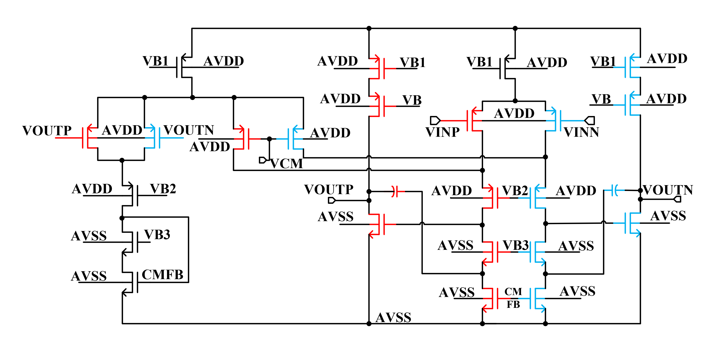

# 模拟电路优化框架

基于双通道爬山算法的模拟电路尺寸优化框架，为2025-EDA精英挑战赛赛题六-模拟电路自动尺寸优化设计开发。

## 主要特性

- **对称性检测**: 使用Weisfeiler-Lehman算法自动识别对称器件，降低优化参数空间



- **双通道策略**: 严格目标优先，失败后自动放宽约束的鲁棒优化策略
- **增强爬山算法**: 包含参数冻结和贪心跳跃机制
- **并行仿真**: 实现高效的多PVT角点并行仿真

## 项目结构

```
├── optimization.py           # 主要优化入口
├── src/
│   ├── circuit_analyzer.py   # WL对称性检测
│   ├── optimizer.py          # 并行仿真平台
│   ├── graph_builder.py      # 电路图构建
│   ├── data_models.py        # 数据结构
│   ├── parallel_utils.py     # 并行处理工具
│   ├── utils.py              # 辅助函数
│   └── eda_interface.py      # EDA工具接口
├── img/                      # 图片和图表
├── docs/                     # 文档
└── requirements.txt          # 依赖项
```

## 环境要求

- **pyAether** - 华大九天商业EDA工具链
- Python 3.9+
- numpy, scipy

## 快速开始

```bash
python optimization.py \
    --ae_lib 库名称 \
    --ae_cell 单元名称 \
    --ae_view schematic \
    --mde_cell MDE单元名称 \
    --mde_view MDE视图名称 \
    --param_file 参数文件.txt \
    --best_param_file 输出文件.txt
```

## 优化策略

### 第一阶段: 严格目标
- 使用严格性能指标进行优化（如80dB增益）
- 采用参数冻结和贪心跳跃的爬山算法

### 第二阶段: 放宽目标
- 如果第一阶段失败，自动放宽约束条件
- 从第一阶段最佳结果继续优化
- 重点关注UGB和面积优化

## 性能结果


## 实现细节

- **参数空间降维**: Case1: 193→140个参数, Case2: 113→85个参数
- **并行仿真**: 使用多进程实现9角点PVT仿真
- **收敛性能**: Case1在431次迭代内收敛，Case2约600次迭代

## 竞赛背景

为2025年EDA精英挑战赛-模拟电路自动尺寸优化开发。参与奖

注：为了提交测试平台，做了接口封装，很多原本可以使用的运行指令被取消了，具体请见main分支开发历史。
